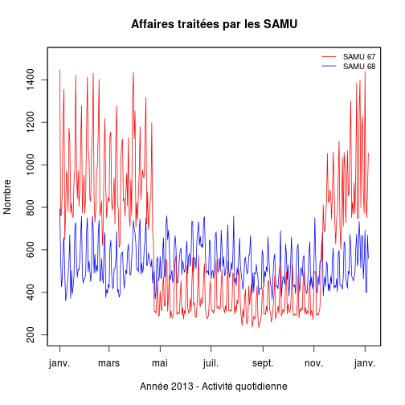

Activité SAMU 2013
========================================================
Auteur: JcB ('r as.character(Sys.Date())')
Date de création: 20132-08-04


```r
as.character(Sys.Date())
```

```
## [1] "2013-10-12"
```

```r
sessionInfo()
```

```
## R version 3.0.2 (2013-09-25)
## Platform: x86_64-pc-linux-gnu (64-bit)
## 
## locale:
##  [1] LC_CTYPE=fr_FR.UTF-8       LC_NUMERIC=C              
##  [3] LC_TIME=fr_FR.UTF-8        LC_COLLATE=fr_FR.UTF-8    
##  [5] LC_MONETARY=fr_FR.UTF-8    LC_MESSAGES=fr_FR.UTF-8   
##  [7] LC_PAPER=fr_FR.UTF-8       LC_NAME=C                 
##  [9] LC_ADDRESS=C               LC_TELEPHONE=C            
## [11] LC_MEASUREMENT=fr_FR.UTF-8 LC_IDENTIFICATION=C       
## 
## attached base packages:
## [1] stats     graphics  grDevices utils     datasets  methods   base     
## 
## other attached packages:
## [1] knitr_1.5
## 
## loaded via a namespace (and not attached):
## [1] evaluate_0.5.1 formatR_0.9    stringr_0.6.2  tools_3.0.2
```

Introduction
------------
Les données brutes sont récupérées à partir du serveur régional Sagec et copiée collées dans le fichier */Stat Resural/SAU2013/samu2013.csv*. Contient les informations des SAMU 67 et 68.
Les données sont:

n°  |  intitulé  |  remarque  
----|------------|-----------  
[1] | date       | date du jour au format jj/mm/aaaa  
[2] | service    | SAMU 67 ou SAMU 68  
[3] | affaires   | nombre d'affaires traitées par le SAMU  
[4] | primaires  | nombre d'interventions primaires  
[5] | secondaires| nombre d'interventions secondaires  
[6] | néonat     | nombre de transfert de néonatalogie  
[7] | secondaires| nombre de transfert infirmier inter-hospitaliers  
[8] | ASSU       | nombre de transport réalisés par une ASSU à la demande du SAMU  
[9] | VSAV       | nombre de transport réalisés par le SDIS à la demande du SAMU  
[10] | conseils  | nombre d'affaires réglées par un conseil médical de la régulation  
[11] | Medecins  | nombre de médecins libéraux envoyés par le Centre 15  


```r
file2 <- "../SAU2013/samu2013.csv"
samu <- read.csv(file2, header = T, sep = ",")
names(samu)
```

```
##  [1] "date"        "service"     "affaires"    "primaires"   "secondaires"
##  [6] "néonat"      "TIIH"        "ASSU"        "VSAV"        "conseils"   
## [11] "Medecins"
```

```r
str(samu)
```

```
## 'data.frame':	547 obs. of  11 variables:
##  $ date       : Factor w/ 274 levels "10/01/2013","10/02/2013",..: 219 204 196 188 179 170 161 152 143 134 ...
##  $ service    : Factor w/ 2 levels "SAMU 67","SAMU 68": 1 1 1 1 1 1 1 1 1 1 ...
##  $ affaires   : int  307 338 300 480 492 354 311 317 316 314 ...
##  $ primaires  : int  31 45 33 35 39 31 41 35 38 21 ...
##  $ secondaires: int  10 10 9 1 7 7 10 8 10 5 ...
##  $ néonat     : int  1 1 0 1 1 1 2 4 2 1 ...
##  $ TIIH       : int  0 0 0 0 0 0 0 0 0 0 ...
##  $ ASSU       : int  80 90 78 82 94 91 63 85 85 90 ...
##  $ VSAV       : int  28 26 30 38 41 30 28 26 15 30 ...
##  $ conseils   : int  53 44 35 126 83 63 41 56 64 46 ...
##  $ Medecins   : int  35 40 49 177 134 50 47 47 27 40 ...
```

```r
samu$date <- as.Date(samu$date, format = "%j/%m/%Y")
max(samu$date)
```

```
## [1] "2013-10-01"
```

Période d'étude:

```r
range(samu$date)
```

```
## [1] "2013-01-01" "2013-10-01"
```

Variables
---------

variable | commentaires 
---------|-------------  
samu67 | dataframe de toutes les lignes concernant le SAMU 67  
samu68   | dataframe de toutes les lignes concernant le SAMU 68  
aff_samu67 | nombre d'affaires SAMU 67  
aff_samu68 | nombre d'affaires SAMU 68  


```r
samu67 <- samu[samu$service == "SAMU 67", ]
samu68 <- samu[samu$service == "SAMU 68", ]
```


Librairies
----------

```r
library("zoo")
```

```
## 
## Attaching package: 'zoo'
## 
## Les objets suivants sont masqués from 'package:base':
## 
##     as.Date, as.Date.numeric
```

```r
library("lubridate")
```


Constantes
----------

```r
pop.67.2010.municipale <- 1095905
pop.68.2010.municipale <- 749782
```


Calculs
-------
#### nombre d'affaires:

```r
aff_samu67 <- sum(samu67$affaires)
aff_samu68 <- sum(samu68$affaires)
aff_samu67
```

```
## [1] 163747
```

```r
mean(samu67$affaires)
```

```
## [1] 597.6
```

```r
aff_samu68
```

```
## [1] 146801
```

```r
mean(samu68$affaires)
```

```
## [1] 537.7
```

```r

tapply(samu$affaires, samu$service, summary)
```

```
## $`SAMU 67`
##    Min. 1st Qu.  Median    Mean 3rd Qu.    Max. 
##     234     316     458     598     832    1450 
## 
## $`SAMU 68`
##    Min. 1st Qu.  Median    Mean 3rd Qu.    Max. 
##     360     471     511     538     598     793
```

```r
tapply(samu$primaire, samu$service, summary)
```

```
## $`SAMU 67`
##    Min. 1st Qu.  Median    Mean 3rd Qu.    Max. 
##    16.0    32.2    38.0    37.7    43.0    60.0 
## 
## $`SAMU 68`
##    Min. 1st Qu.  Median    Mean 3rd Qu.    Max. 
##     6.0    13.0    16.0    16.2    19.0    31.0
```

```r
tapply(samu$secondaire, samu$service, summary)
```

```
## $`SAMU 67`
##    Min. 1st Qu.  Median    Mean 3rd Qu.    Max. 
##    0.00    5.00    8.00    7.71   10.00   19.00 
## 
## $`SAMU 68`
##    Min. 1st Qu.  Median    Mean 3rd Qu.    Max. 
##     0.0     4.0     6.0     6.2     8.0    22.0
```

```r
tapply(samu$néonat, samu$service, summary)
```

```
## $`SAMU 67`
##    Min. 1st Qu.  Median    Mean 3rd Qu.    Max. 
##    0.00    0.00    1.00    1.39    2.00    8.00 
## 
## $`SAMU 68`
##    Min. 1st Qu.  Median    Mean 3rd Qu.    Max. 
##  0.0000  0.0000  0.0000  0.0659  0.0000  2.0000
```

```r
tapply(samu$TIIH, samu$service, summary)
```

```
## $`SAMU 67`
##    Min. 1st Qu.  Median    Mean 3rd Qu.    Max. 
##       0       0       0       0       0       0 
## 
## $`SAMU 68`
##    Min. 1st Qu.  Median    Mean 3rd Qu.    Max. 
##       0       0       0       0       0       0
```

```r
tapply(samu$ASSU, samu$service, summary)
```

```
## $`SAMU 67`
##    Min. 1st Qu.  Median    Mean 3rd Qu.    Max. 
##    57.0    81.0    90.0    92.2   103.0   153.0 
## 
## $`SAMU 68`
##    Min. 1st Qu.  Median    Mean 3rd Qu.    Max. 
##     9.0    19.0    22.0    22.4    26.0    39.0
```

```r
tapply(samu$VSAV, samu$service, summary)
```

```
## $`SAMU 67`
##    Min. 1st Qu.  Median    Mean 3rd Qu.    Max. 
##    15.0    24.0    29.0    29.5    34.0    67.0 
## 
## $`SAMU 68`
##    Min. 1st Qu.  Median    Mean 3rd Qu.    Max. 
##    47.0    71.0    81.0    81.1    91.0   118.0
```

```r
tapply(samu$conseils, samu$service, summary)
```

```
## $`SAMU 67`
##    Min. 1st Qu.  Median    Mean 3rd Qu.    Max. 
##    26.0    50.0    65.0    76.1    90.0   252.0 
## 
## $`SAMU 68`
##    Min. 1st Qu.  Median    Mean 3rd Qu.    Max. 
##      78     120     145     161     191     445
```

```r
tapply(samu$Medecin, samu$service, summary)
```

```
## $`SAMU 67`
##    Min. 1st Qu.  Median    Mean 3rd Qu.    Max. 
##    21.0    41.0    53.5    89.6   120.0   356.0 
## 
## $`SAMU 68`
##    Min. 1st Qu.  Median    Mean 3rd Qu.    Max. 
##    11.0    29.0    38.0    56.5    77.0   260.0
```

taux de recours
---------------

```r
round(aff_samu67 * 100/pop.67.2010.municipale, 2)
```

```
## [1] 14.94
```

```r
round(aff_samu68 * 100/pop.68.2010.municipale, 2)
```

```
## [1] 19.58
```


Graphiques
-----------
#### activité en nb d'affaires

```r
z67 <- zoo(samu67$affaires, samu67$date)
z68 <- zoo(samu68$affaires, samu68$date)

plot(z68, ylim = c(200, 1500), col = "blue", xlab = "", ylab = "")
lines(z67, ylim = c(200, 1500), col = "red")
title(main = "Affaires traitées par les SAMU", ylab = "Nombre", xlab = "Année 2013 - Activité quotidienne")
legend("topright", legend = c("SAMU 67", "SAMU 68"), col = c("red", "blue"), 
    lty = 1, bty = "n", cex = 0.8)
```

 

