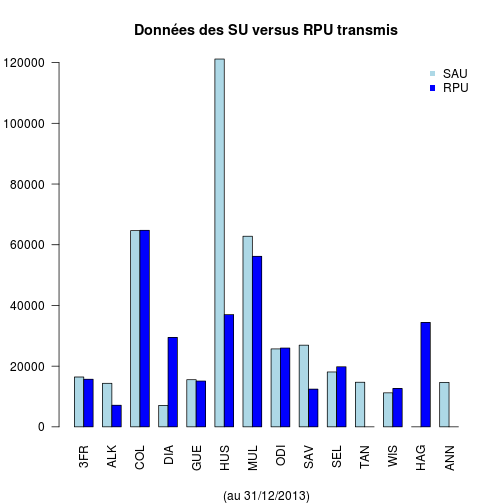
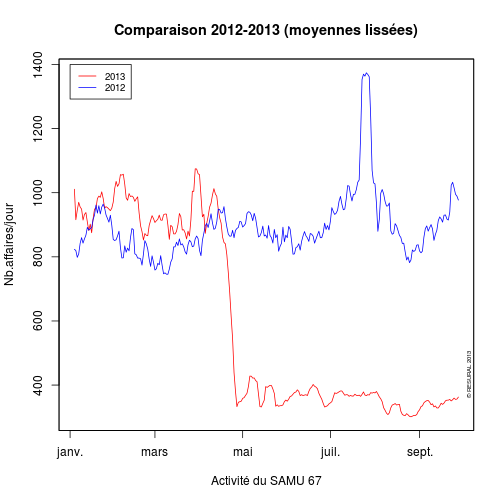

Etude des SAU d'Alsace en 2013
========================================================

L'étude porte du 1/1/2013 au 31/12/2013 avec un compatatif sur la même période en 2012.
Les données sont extraite de SAGEC HUS et copiées/collées dans un tableur libre office. La dernière colonne (supprimer) est supprimées. La feuille est enregistrée sous *sau2013.csv*

Le présent document exploite les données du fichier binaire *sau2013.Rda* (voir le document *sau2013_Preparation_donnees.Rmd* pour la création de ce fichier).


```r
file <- "~/Documents/Resural/Stat Resural/SAU2013"
setwd(file)
timestamp()
```

```
## ##------ Wed Jan  8 21:08:14 2014 ------##
```

```r
# Chargement:
load("sau2013.Rda")
```


Résumé des donnnées
-------------------
d = dataframe pour 2013

```r
names(d)
```

```
##  [1] "date"              "Organisme"         "service"          
##  [4] "moins.de.1.an"     "plus.de.75.ans"    "entre.1.et.75.ans"
##  [7] "TOTAL.passages"    "hospitalisés"      "UHCD"             
## [10] "Transferts"        "X"                 "hop"              
## [13] "ser2"
```

```r
min(d$date)
```

```
## [1] "2013-01-01"
```

```r
max(d$date)
```

```
## [1] "2014-01-05"
```


analyse des données
-------------------
Tableau de l'ensemble des passages par jour pour l'ensemble des SAU:

```r
hosp2013 <- tapply(d$hospitalisés, d$date, sum)
# hosp2013

# nombre total de passages
sum(d$TOTAL.passages)
```

```
## [1] 398858
```

Moyenne des passages par jour ensemble des SAU:
-----------------------------------------------

```r
mean(hosp2013)
```

```
## [1] 191.7
```

```r
summary(hosp2013)
```

```
##    Min. 1st Qu.  Median    Mean 3rd Qu.    Max. 
##      82     176     193     192     210     269
```

```r
plot(hosp2013, pch = 19, col = "red", ylab = "Passages", xlab = "Jours", type = "l")
abline(h = mean(hosp2013), col = "blue")
```

 


Passages par jour/SAU
----------------------

```r
a <- tapply(d$TOTAL.passages, d$hop, sum)
a
```

```
##    ALK    COL    CTF    DIA    GEB    HUS    MUL    ODI    SAV    SEL 
##  14352  64650  16423   7078  15531 121190  62806  25675  26915  18076 
##    TAN    WIS 
##  14704  11205
```

```r
barplot(sort(a), cex.names = 0.5, cex.axis = 0.5, ylab = "nombre de passages", 
    xlab = "Services d'urgence", main = "Passages dans les sercices d'urgence en 2013")
```

 


Comparaison SAU - RPU
---------------------
Saisie manuelle. Données à jour au 31 octobre 2013. *sau* sont les données obtenues au paragraphe *Passages par jour/SAU*. les données *rpu* sont fournies par le programme *rpu2013*.
 


Ratio hospitalisation/passage.
------------------------------
Hospitalisation est la somme des hospitalisations dans les servives + UHCD:

```r
hosp2013 <- tapply(d$hospitalisés, d$date, sum)
b <- round(100 * (d$hospitalisés + d$UHCD)/d$TOTAL.passages, 2)
```

taux moyen d'hospitalisation durant la période:
----------------------------------------------

```r
m1 <- mean(b, na.rm = T)
m1
```

```
## [1] Inf
```

```r
sd(b, na.rm = T)
```

```
## [1] NaN
```

Taux moyen d'hospitalisation par jour:

```r
a <- tapply(b, d$date, mean, na.rm = T)
plot(a, pch = 19, col = "red")
abline(h = m1, col = "blue")
```

 

Comparaison 2013 - 2012
-----------------------
On récupère les données 2012 et on utilise par(new=T) pour superposer 2 graphiques:

```r
load("../SAU2012/sau2012.Rda")
a2 <- tapply(d2$TOTAL.passages, d2$date, sum)
a <- tapply(d$TOTAL.passages, d$date, sum)
# sauvegarde des paramètres graphique
old <- par()
# calcul d'une ordonnée commune aux 2 courbes
ylim1 <- range(c(max(a), min(a2)))
# on trace la première
plot(a, ylim = ylim1, pch = 19, col = "red", ylab = "Passages", xlab = "1er janvier au 21 février", 
    main = "Comparaison 2012-2013", sub = "(Ensemble des services d'urgence d'Alsace)")
# on modifie par() pour forcer la superposition
par(new = TRUE, ann = FALSE)
# desssin de la 2ème courbe
plot(a2, ylim = ylim1, pch = 19, col = "blue", axes = FALSE)
# tracé des droites moyennes
abline(h = mean(a2), col = "blue")
abline(h = mean(a), col = "red")
# tracé des lignes joignant les points
lines(a, ylim = ylim1, pch = 19, col = "red")
lines(a2, ylim = ylim1, pch = 19, col = "blue")
# ajout de la légende
legend(40, 1400, c("2012", "2013"), lty = c(1, 1), lwd = c(2.5, 2.5), col = c("blue", 
    "red"), bty = "n")
# copyright
mtext("© RESURAL 2013", cex = 0.5, side = 4, line = -1, adj = 0.1)
```

 

```r
# restauration des paramètres graphiques
par(old)
```

```
## Warning: graphical parameter "cin" cannot be set
## Warning: graphical parameter "cra" cannot be set
## Warning: graphical parameter "csi" cannot be set
## Warning: graphical parameter "cxy" cannot be set
## Warning: graphical parameter "din" cannot be set
## Warning: graphical parameter "page" cannot be set
```

Comparaison des activités:

```r
n <- length(a)
n
```

```
## [1] 370
```

```r
summary(a)
```

```
##    Min. 1st Qu.  Median    Mean 3rd Qu.    Max. 
##     787     989    1080    1080    1160    1460
```

```r
summary(a2[1:n])
```

```
##    Min. 1st Qu.  Median    Mean 3rd Qu.    Max.    NA's 
##     672     950    1040    1040    1140    1840       4
```

```r
round((mean(a)/mean(a2[1:n]) - 1) * 100, 2)
```

```
## [1] NA
```

Pour présenter ces tableaux en Latex:

stargazer(as.data.frame(a),summary=TRUE)

stargazer(as.data.frame(a2[1:length(a)]),summary=TRUE,digit.separator=" ",digits=2,median=TRUE,iqr=TRUE)

voir RPU2013/sweve/test pour un exemple


Utilisation de la librairie *zoo*

```r
library("zoo")
```

```
## 
## Attaching package: 'zoo'
## 
## Les objets suivants sont masqués from 'package:base':
## 
##     as.Date, as.Date.numeric
```

```r
tsa <- zoo(a, unique(d$date))
head(tsa)
```

```
## 2013-01-01 2013-01-02 2013-01-03 2013-01-04 2013-01-05 2013-01-06 
##       1002        911        982       1095       1054       1113
```

```r
plot(tsa)
```

 

```r
tsb <- zoo(a2, unique(d2$date))
plot(tsb)
```

 

Moyenne lissée sur 7 jours

```r
ma <- rollmean(tsa, 7)
plot(ma, main = "Moyenne lissée sur 7 jours")
```

 

```r

mb <- rollmean(tsb, 7)
plot(mb, main = "Moyenne lissée sur 7 jours")
```

 

Utilisation de *xts*

```r
library("xts")
ts2 <- xts(a, unique(d$date))
```

Combinaison des deux courbes:

```r
tsc <- zoo(cbind(a, a2[1:length(a)]), unique(d$date))
plot(tsc)
```

 

```r
plot(tsc, screens = 1, col = c("red", "blue"), main = "Activité des SU en 2012 et 2013", 
    ylab = "nombre de passages")
legend(as.Date("2013-01-01"), 1800, c("2013", "2012"), col = c("red", "blue"), 
    lty = "solid")
mtext("© RESURAL 2013", cex = 0.5, side = 4, line = -1, adj = 0.1)
```

 

moyennes lissées:

```r
tsc2 <- zoo(cbind(as.numeric(ma), as.numeric(mb[1:length(ma)])), unique(d$date))
```

```
## Warning: some methods for "zoo" objects do not work if the index entries
## in 'order.by' are not unique
```

```r
plot(tsc2, screens = 1, col = c("red", "blue"), main = "Activité des SU en 2012 et 2013", 
    ylab = "nombre de passages", ylim = c(800, 1400))
legend(as.Date("2013-01-01"), 1400, c("2013", "2012"), col = c("red", "blue"), 
    lty = "solid")
mtext("© RESURAL 2013", cex = 0.5, side = 4, line = -1, adj = 0.1)
```

 

Activité des SAMU
=================

```r
samu <- read.csv("samu2013.csv", header = TRUE)
names(samu)
```

```
##  [1] "date"        "service"     "affaires"    "primaires"   "secondaires"
##  [6] "néonat"      "TIIH"        "ASSU"        "VSAV"        "conseils"   
## [11] "Medecins"
```

```r
samu$date <- as.Date(samu$date, "%d/%m/%Y")
min(samu$date)
```

```
## [1] "2013-01-01"
```

```r
max(samu$date)
```

```
## [1] "2013-10-01"
```


Créer 2 SAMU:

```r
s67 <- samu[samu$service == "SAMU 67", ]
s68 <- samu[samu$service == "SAMU 68", ]
ts67 <- zoo(s67$affaires, s67$date)
plot(ts67)
```

 

```r
ts68 <- zoo(s68$affaires, s68$date)
plot(ts68)
```

 

```r
tssa <- zoo(cbind(s67$affaires, s68$affaires), s67$date)
```

```
## Warning: number of rows of result is not a multiple of vector length (arg
## 2)
```

```r
plot(tssa)
```

 

```r

plot(tssa, screens = 1, col = c("red", "blue"), main = "Activité des SAMU en 2013", 
    ylab = "nombre d'affaires", ylim = c(400, 1600), xlab = "Date(jours)")
legend(as.Date("2013-01-01"), 1600, c("SAMU 67", "SAMU 68"), col = c("red", 
    "blue"), lty = "solid", cex = 0.5)
mtext("© RESURAL 2013", cex = 0.5, side = 4, line = -1, adj = 0.1)
```

 

Courbes lissées

```r
m67 <- rollmean(tssa, 7)
plot(m67, screens = 1, col = c("red", "blue"), main = "Activité des SAMU en 2013", 
    ylab = "nombre d'affaires", ylim = c(400, 1600), xlab = "Date(jours)")
legend(as.Date("2013-01-01"), 1600, c("SAMU 67", "SAMU 68"), col = c("red", 
    "blue"), lty = "solid", cex = 0.5)
mtext("© RESURAL 2013", cex = 0.5, side = 4, line = -1, adj = 0.1)
```

 

Chargement du fichier pour 2012:
---------------------------------

```r
samu2012 <- read.csv("samu2012.csv", header = TRUE)
names(samu2012)
```

```
##  [1] "date"        "service"     "affaires"    "primaires"   "secondaires"
##  [6] "néonat"      "TIIH"        "ASSU"        "VSAV"        "conseils"   
## [11] "Medecins"
```

```r
samu2012$date <- as.Date(samu2012$date, "%d/%m/%Y")
min(samu2012$date)
```

```
## [1] "2012-01-01"
```

```r
max(samu2012$date)
```

```
## [1] "2012-12-31"
```

```r

min(samu2012$date[samu2012$service == "SAMU 68"])
```

```
## [1] "2012-06-20"
```

Il manque les données pour le premier semestre 2012 pour le samu 68

Créer les SAMU:

```r
s672012 <- samu2012[samu2012$service == "SAMU 67", ]
ts672012a <- zoo(s672012$affaires, s672012$date)
plot(ts672012a, main = "Affaires - SAMU 67 en 2012")
```

 

```r
m67672012a <- rollmean(ts672012a, 7)
plot(m67672012a, main = "Affaires (lissage) - SAMU 67 en 2012")
```

 

Comparaison 2012-2013

```r
tssa2 <- zoo(cbind(s67$affaires, s672012$affaires), s67$date)
```

```
## Warning: number of rows of result is not a multiple of vector length (arg
## 1)
```

```r
plot(tssa2, screens = 1, col = c("red", "blue"), main = "Comparaison 2012-2013")
```

 

```r
tssa2lisse <- rollmean(tssa2, 7)
plot(tssa2lisse, screens = 1, col = c("red", "blue"), main = "Comparaison 2012-2013 (moyennes lissées)", 
    xlab = "Activité du SAMU 67", ylab = "Nb.affaires/jour")
legend(as.Date("2013-01-01"), 1400, c("2013", "2012"), col = c("red", "blue"), 
    lty = "solid", cex = 0.8)
mtext("© RESURAL 2013", cex = 0.5, side = 4, line = -1, adj = 0.1)
```

 

Comparaison passages/hospitalisations
-------------------------------------

```r
hosp2013 <- tapply(d$hospitalisés, d$date, sum)
mean(hosp2013)
```

```
## [1] 191.7
```

```r
sd(passage2013)
```

```
## Error: objet 'passage2013' introuvable
```

```r
median(passage2013)
```

```
## Error: objet 'passage2013' introuvable
```

```r

passage2013 <- tapply(d$TOTAL.passages, d$date, sum)
mean(passage2013)
```

```
## [1] 1078
```

```r
sd(passage2013)
```

```
## [1] 122.4
```

```r
median(passage2013)
```

```
## [1] 1080
```

```r

round(mean(hosp2013) * 100/mean(passage2013), 2)
```

```
## [1] 17.78
```

```r

a <- cbind(passage2013, hosp2013)
zoo2013 <- zoo(a, unique(d$date))
plot(zoo2013)
```

 

```r
zoo2013lisse <- rollmean(zoo2013, 7)
plot(zoo2013lisse, screens = 1, main = "2013 - Passages vs hospitalisation", 
    col = c("red", "blue"), xlab = "Moyennes lissées")
legend(as.Date("2013-01-01"), 800, c("passages", "hospitalizations"), col = c("red", 
    "blue"), lty = "solid", cex = 0.8)
mtext("© RESURAL 2013", cex = 0.5, side = 4, line = -1, adj = 0.1)
```

 


