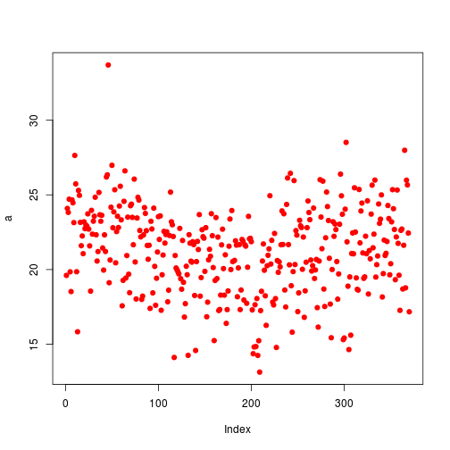
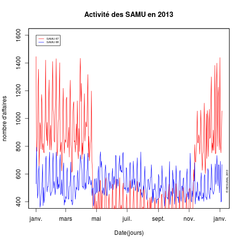
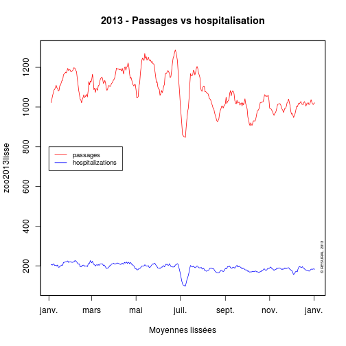

Etude des SAU d'Alsace en 2013
========================================================

L'étude porte du 1/1/2013 au 31/12/2013 avec un compatatif sur la même période en 2012.
Les données sont extraite de SAGEC HUS et copiées/collées dans un tableur libre office. La dernière colonne (supprimer) est supprimée. La feuille est enregistrée sous *sau2013.csv*

Le présent document exploite les données du fichier binaire *sau2013.Rda* (voir le document *sau2013_Preparation_donnees.Rmd* pour la création de ce fichier).


```r
file <- "~/Documents/Resural/Stat Resural/SAU2013"
setwd(file)
timestamp()
```

```
## ##------ Sat Jan 25 21:00:14 2014 ------##
```

```r
# Chargement:
load("sau2013.Rda")
library("xts")
```

```
## Loading required package: zoo
## 
## Attaching package: 'zoo'
## 
## Les objets suivants sont masqués from 'package:base':
## 
##     as.Date, as.Date.numeric
```

```r
library("zoo")
```


Retraitement des données pour SAverne
-------------------------------------
Saverne envoie 2 fichiers, l'un pour les adultes, l'autre pour les enfants. On  effectue un regroupement des deux:
- savp = secteur pédiatrique
- sava = secteur adulte


```r
sav <- d[d$Organisme == "CH de Saverne", ]
savp <- d[d$Organisme == "CH de Saverne" & d$service == "PEDIATRIE", ]
sava <- d[d$Organisme == "CH de Saverne" & d$ser2 == "aSAV", ]
sav <- sava
sav$service <- "SU Saverne"
sav$moins.de.1.an <- savp$moins.de.1.an
sav$entre.1.et.75.ans <- sava$entre.1.et.75.ans + savp$entre.1.et.75.ans
sav$TOTAL.passages <- sava$TOTAL.passages + savp$TOTAL.passages
sav$hospitalisés <- sava$hospitalisés + savp$hospitalisés
sav$UHCD <- sava$UHCD + savp$UHCD
sav$Transferts <- sava$Transferts + savp$Transferts
```


Résumé des donnnées
-------------------
d = dataframe pour 2013

```r
names(d)
```

```
##  [1] "date"              "Organisme"         "service"          
##  [4] "moins.de.1.an"     "plus.de.75.ans"    "entre.1.et.75.ans"
##  [7] "TOTAL.passages"    "hospitalisés"      "UHCD"             
## [10] "Transferts"        "X"                 "hop"              
## [13] "ser2"
```

```r
min(d$date)
```

```
## [1] "2013-01-01"
```

```r
max(d$date)
```

```
## [1] "2014-01-05"
```

```r
nb_jour <- max(d$date) - min(d$date)
dt <- seq(min(d$date), max(d$date), 1)  # vecteur temporel
nb_jour
```

```
## Time difference of 369 days
```

```r

summary(d$Organisme)
```

```
##                                     CCOM 
##                                      360 
##                              CH Altkirch 
##                                      363 
##               CH de Colmar (CMC Le Parc) 
##                                      370 
##             CH de Colmar (Louis Pasteur) 
##                                      370 
##                         CH de Guebwiller 
##                                      368 
## CH de Mulhouse (Emile Muller-Moenschberg 
##                                      368 
##              CH de Mulhouse ( Hasenrain) 
##                                      368 
##                            CH de Saverne 
##                                      740 
##                           CH de Sélestat 
##                                      214 
##                              CH de Thann 
##                                      349 
##                        CH de Wissembourg 
##                                      305 
##           CHU de Strasbourg(Hautepierre) 
##                                     1445 
##           CHU de Strasbourg (Hôp. Civil) 
##                                      359 
##                Clinique des 3 Frontières 
##                                      365 
##                 Clinique des Diaconesses 
##                                      207 
##           Clinique Ste Odile (Strasbourg 
##                                      360 
##                                     CMCO 
##                                      370 
##                              SIHCUS/CMCO 
##                                      359
```

```r
# jours manquants
summary(d$Organisme) - nb_jour
```

```
## Time differences in days
##                                     CCOM 
##                                       -9 
##                              CH Altkirch 
##                                       -6 
##               CH de Colmar (CMC Le Parc) 
##                                        1 
##             CH de Colmar (Louis Pasteur) 
##                                        1 
##                         CH de Guebwiller 
##                                       -1 
## CH de Mulhouse (Emile Muller-Moenschberg 
##                                       -1 
##              CH de Mulhouse ( Hasenrain) 
##                                       -1 
##                            CH de Saverne 
##                                      371 
##                           CH de Sélestat 
##                                     -155 
##                              CH de Thann 
##                                      -20 
##                        CH de Wissembourg 
##                                      -64 
##           CHU de Strasbourg(Hautepierre) 
##                                     1076 
##           CHU de Strasbourg (Hôp. Civil) 
##                                      -10 
##                Clinique des 3 Frontières 
##                                       -4 
##                 Clinique des Diaconesses 
##                                     -162 
##           Clinique Ste Odile (Strasbourg 
##                                       -9 
##                                     CMCO 
##                                        1 
##                              SIHCUS/CMCO 
##                                      -10
```

**Saverne** à le double des autres (adultes et pediatie)

analyse des données
-------------------
Tableau de l'ensemble des passages par jour pour l'ensemble des SAU:

```r
# nombre total de passages
sum(d$TOTAL.passages)
```

```
## [1] 398858
```

Analyse des hospitalisations
----------------------------

```r
hosp2013 <- tapply(d$hospitalisés, d$date, sum)
ts_zoo <- zoo(hosp2013, dt)
plot(ts_zoo, main = "2013-Hospitalisations hors UHCD", xlab = "jours", ylab = "Nombre d'hospitalisations")
```

 

```r

ts_xts <- xts(hosp2013, dt)
plot(ts_xts, main = "2013-Hospitalisations hors UHCD", xlab = "jours", ylab = "Nombre d'hospitalisations")
```

 

```r

# on combine 2 ts, passages et hospitalisations
pass2013 <- tapply(d$TOTAL.passages, d$date, sum)
# taux hospitalisation
tx <- hosp2013/pass2013
# création matrice
a <- cbind(hosp2013, pass2013, tx)
ts_zoo <- zoo(a, dt)
# deux courbes dans le même graphique
plot(ts_zoo, screens = 1)
```

 

```r
# deux graphiques superposés
plot(ts_zoo, screens = c(1, 2, 3), main = "2013 - Passages vs Hospitalisations", 
    ylab = c("Hospitalisations", "Passages", "Taux hosp."), col = c("blue", 
        "green", "red"))
```

 

```r
# moyenne mobile
k <- 7
ma <- rollmean(ts_zoo, k)
head(ma)
```

```
##            hosp2013 pass2013     tx
## 2013-01-04    213.1     1128 0.1895
## 2013-01-05    207.6     1080 0.1922
## 2013-01-06    196.4     1051 0.1877
## 2013-01-07    199.7     1063 0.1884
## 2013-01-08    198.9     1059 0.1885
## 2013-01-09    199.9     1052 0.1906
```

```r
sda <- rollapply(ts_zoo, k, sd, align = "right")
head(sda)
```

```
##            hosp2013 pass2013      tx
## 2013-01-07    36.40   137.95 0.02714
## 2013-01-08    33.00    74.92 0.02678
## 2013-01-09    19.00    49.49 0.02351
## 2013-01-10    21.72    44.77 0.02405
## 2013-01-11    21.07    50.08 0.02413
## 2013-01-12    20.97    43.76 0.02327
```

```r

plot(ts_zoo[, 1], col = "orange", main = "2013 - Hospitalisations", ylab = "nombre")
lines(ma[, 1], col = "red", lty = 2)
lines(ma[, 1] + sda[, 1], col = "red")
lines(ma[, 1] - sda[, 1], col = "red")
legend("bottomleft", legend = c("nombre", "moyenne lissée", "ecart_type", "moyenne mensuelle"), 
    col = c("orange", "red", "red", "blue"), lty = c(1, 2, 1, 1))


# moyenne des hospitalisations par mois
mm <- apply.monthly(ts_zoo, mean)
lines(mm[, 1], col = "blue")
```

 

```r
plot(mm[, 1], col = "blue", main = "2013 - Moyenne des hospitalisations", ylab = "moyenne")
```

 

```r
# ecart-type
sdmm <- apply.monthly(ts_zoo, sd)
# on peut faire les mêmes calculs par semaine, jour, années, quadrimestre
# apply.weekly(ts, f) colors <- ifelse(x >= 0, 'black', 'gray')

# idem avec xts
ts_xts <- xts(a, dt)
plot(ts_xts[, 2])
```

 

```r
plot(ts_xts[, 1])
```

 

```r
plot(ts_xts[, 3])
```

 

```r
# a priori xts ne sait faire que de l'univarié
first(ts_xts, "5 days")
```

```
##            hosp2013 pass2013     tx
## 2013-01-01      248     1392 0.1782
## 2013-01-02      269     1215 0.2214
## 2013-01-03      201      998 0.2014
## 2013-01-04      216     1028 0.2101
## 2013-01-05      194     1116 0.1738
```

```r
last(ts_xts, "week")
```

```
##            hosp2013 pass2013     tx
## 2013-12-30      205     1081 0.1896
## 2013-12-31      187      807 0.2317
## 2014-01-01      171     1140 0.1500
## 2014-01-02      226     1016 0.2224
## 2014-01-03      224     1041 0.2152
## 2014-01-04      205     1083 0.1893
## 2014-01-05      155     1029 0.1506
```

```r
# accepte aussi years

# on peut sélectionner un jour donné ou par périodes
ts_xts[5]
```

```
##            hosp2013 pass2013     tx
## 2013-01-05      194     1116 0.1738
```

```r
ts_xts[5, 1]
```

```
##            hosp2013
## 2013-01-05      194
```

```r
ts_xts[5:10]
```

```
##            hosp2013 pass2013     tx
## 2013-01-05      194     1116 0.1738
## 2013-01-06      158     1120 0.1411
## 2013-01-07      206     1029 0.2002
## 2013-01-08      209     1057 0.1977
## 2013-01-09      191     1008 0.1895
## 2013-01-10      224     1086 0.2063
```

```r
plot(ts_xts[5:10, 2])
```

 

```r

ts_xts["2013-10-19"]
```

```
##            hosp2013 pass2013     tx
## 2013-10-19      189     1103 0.1714
```

```r
ts_xts[seq(as.Date("2013-10-19"), as.Date("2013-10-25"), by = 1)]
```

```
##            hosp2013 pass2013     tx
## 2013-10-19      189     1103 0.1714
## 2013-10-20      140     1009 0.1388
## 2013-10-21      188     1056 0.1780
## 2013-10-22      205     1015 0.2020
## 2013-10-23      224      962 0.2328
## 2013-10-24      210      952 0.2206
## 2013-10-25      216     1000 0.2160
```


Moyenne des passages par jour ensemble des SAU:
-----------------------------------------------

```r
mean(hosp2013)
```

```
## [1] 191.7
```

```r
summary(hosp2013)
```

```
##    Min. 1st Qu.  Median    Mean 3rd Qu.    Max. 
##      82     176     193     192     210     269
```

```r
plot(hosp2013, pch = 19, col = "red", ylab = "Passages", xlab = "Jours", type = "l")
abline(h = mean(hosp2013), col = "blue")
```

 


Passages par jour/SAU
----------------------

```r
a <- tapply(d$TOTAL.passages, d$hop, sum)
a
```

```
##    ALK    COL    CTF    DIA    GEB    HUS    MUL    ODI    SAV    SEL 
##  14352  64650  16423   7078  15531 121190  62806  25675  26915  18076 
##    TAN    WIS 
##  14704  11205
```

```r
# nombre total de passages:
sum(a)
```

```
## [1] 398605
```

```r

barplot(sort(a), cex.names = 0.5, cex.axis = 0.5, ylab = "nombre de passages", 
    xlab = "Services d'urgence", main = "Passages dans les sercices d'urgence en 2013")
```

 


Comparaison SAU - RPU
---------------------
Saisie manuelle. Données à jour au 5 janvier 2014. *sau* sont les données obtenues au paragraphe *Passages par jour/SAU*. les données *rpu* sont fournies par le programme *rpu2013*.
- Ste Anne 2013:    14661
- données RPU pour 2013: 
   3Fr   Alk   Col   Dia   Geb   Hag   Hus   Mul   Odi   Sel   Wis   Sav 
 15688  7126 64758 29469 15103 34414 37018 56195 25963 19790 12646 12424
- données SAU pour 2013:
ALK    COL    CTF    DIA    GEB    HUS    MUL    ODI    SAV    SEL     TAN    WIS
14352  64650  16423   7078  15531 121190  62806  25675  26915  18076   14704  11205
  

```
##       3FR   ALK   COL   DIA   GUE    HUS   MUL   ODI   SAV   SEL   TAN
## sau 16423 14352 64650  7078 15531 121190 62806 25675 26915 18076 14704
## rpu 15688  7126 64758 29469 15103  37018 56195 25963 12424 19790     0
##       WIS   HAG   ANN
## sau 11205     0 14661
## rpu 12646 34414     0
```

 

**Remarques**
- *rpu* ce sont les RPU transmis à e-santé. A terme ce devrait être la seule donnée d'activité recueillie. On remarque pour 2013 qu'on est loin de l'exhaustivité.
- *sau* données d'activité transmise au serveur régional de veille. Ces données sot recueillies depuis 2005 sauf pour trois établissements. Deux d'entre eus (StAnne et Diaconnat fonderie) n'existaient pas en tant que SU au moment de l'implantation du serveur. Le *CH Haguenau* a cessé d'émettre depuis plusieurs années.
- le *SU Saverne* ne transmets des RPU que depuis fin juillet 2013
- le *CH Thann* n'a jamais transmis de RPU
- la Clinique Ste Anne ne transmet pas de RPU mais transmet des données d'activité quotidienne sur le modèle du serveur régional.

- nb total de passages déclarés: **413 266**
- nb total de RPU déclarés: **330 594**  
Si on suppose que le nb de passages déclarés est exact (en réalité sous estimé, par ex. Haguenau), l'exhaustivité mesurée est de l'ordre de **80 %**.

Ratio hospitalisation/passage.
------------------------------
Hospitalisation est la somme des hospitalisations dans les servives + UHCD:

```r
hosp2013 <- tapply(d$hospitalisés, d$date, sum)
b <- round(100 * (d$hospitalisés + d$UHCD)/d$TOTAL.passages, 2)
```

taux moyen d'hospitalisation durant la période:
----------------------------------------------

```r
m1 <- mean(b, na.rm = T)
m1
```

```
## [1] Inf
```

```r
sd(b, na.rm = T)
```

```
## [1] NaN
```

Taux moyen d'hospitalisation par jour:

```r
a <- tapply(b, d$date, mean, na.rm = T)
plot(a, pch = 19, col = "red")
abline(h = m1, col = "blue")
```

 

Comparaison 2013 - 2012
-----------------------
On récupère les données 2012 et on utilise par(new=T) pour superposer 2 graphiques:

```r
load("../SAU2012/sau2012.Rda")
a2 <- tapply(d2$TOTAL.passages, d2$date, sum)
a <- tapply(d$TOTAL.passages, d$date, sum)
# sauvegarde des paramètres graphique
old <- par()
# calcul d'une ordonnée commune aux 2 courbes
ylim1 <- range(c(max(a), min(a2)))
# on trace la première
plot(a, ylim = ylim1, pch = 19, col = "red", ylab = "Passages", xlab = "1er janvier au 21 février", 
    main = "Comparaison 2012-2013", sub = "(Ensemble des services d'urgence d'Alsace)")
# on modifie par() pour forcer la superposition
par(new = TRUE, ann = FALSE)
# desssin de la 2ème courbe
plot(a2, ylim = ylim1, pch = 19, col = "blue", axes = FALSE)
# tracé des droites moyennes
abline(h = mean(a2), col = "blue")
abline(h = mean(a), col = "red")
# tracé des lignes joignant les points
lines(a, ylim = ylim1, pch = 19, col = "red")
lines(a2, ylim = ylim1, pch = 19, col = "blue")
# ajout de la légende
legend(40, 1400, c("2012", "2013"), lty = c(1, 1), lwd = c(2.5, 2.5), col = c("blue", 
    "red"), bty = "n")
# copyright
mtext("© RESURAL 2013", cex = 0.5, side = 4, line = -1, adj = 0.1)
```

 

```r
# restauration des paramètres graphiques
par(old)
```

```
## Warning: graphical parameter "cin" cannot be set
## Warning: graphical parameter "cra" cannot be set
## Warning: graphical parameter "csi" cannot be set
## Warning: graphical parameter "cxy" cannot be set
## Warning: graphical parameter "din" cannot be set
## Warning: graphical parameter "page" cannot be set
```

Comparaison des activités:

```r
n <- length(a)
n
```

```
## [1] 370
```

```r
summary(a)
```

```
##    Min. 1st Qu.  Median    Mean 3rd Qu.    Max. 
##     787     989    1080    1080    1160    1460
```

```r
summary(a2[1:n])
```

```
##    Min. 1st Qu.  Median    Mean 3rd Qu.    Max.    NA's 
##     672     950    1040    1040    1140    1840       4
```

```r
round((mean(a)/mean(a2[1:n]) - 1) * 100, 2)
```

```
## [1] NA
```

Pour présenter ces tableaux en Latex:

stargazer(as.data.frame(a),summary=TRUE)

stargazer(as.data.frame(a2[1:length(a)]),summary=TRUE,digit.separator=" ",digits=2,median=TRUE,iqr=TRUE)

voir RPU2013/sweve/test pour un exemple


Utilisation de la librairie *zoo*

```r
library("zoo")
tsa <- zoo(a, unique(d$date))
head(tsa)
```

```
## 2013-01-01 2013-01-02 2013-01-03 2013-01-04 2013-01-05 2013-01-06 
##       1002        911        982       1095       1054       1113
```

```r
plot(tsa)
```

 

```r
tsb <- zoo(a2, unique(d2$date))
plot(tsb)
```

 

Moyenne lissée sur 7 jours

```r
ma <- rollmean(tsa, 7)
plot(ma, main = "Moyenne lissée sur 7 jours")
```

 

```r

mb <- rollmean(tsb, 7)
plot(mb, main = "Moyenne lissée sur 7 jours")
```

 

Utilisation de *xts*

```r
library("xts")
ts2 <- xts(a, unique(d$date))
```

Combinaison des deux courbes:

```r
tsc <- zoo(cbind(a, a2[1:length(a)]), unique(d$date))
plot(tsc)
```

 

```r
plot(tsc, screens = 1, col = c("red", "blue"), main = "Activité des SU en 2012 et 2013", 
    ylab = "nombre de passages")
legend(as.Date("2013-01-01"), 1800, c("2013", "2012"), col = c("red", "blue"), 
    lty = "solid")
mtext("© RESURAL 2013", cex = 0.5, side = 4, line = -1, adj = 0.1)
```

 

moyennes lissées:

```r
tsc2 <- zoo(cbind(as.numeric(ma), as.numeric(mb[1:length(ma)])), unique(d$date))
```

```
## Warning: some methods for "zoo" objects do not work if the index entries
## in 'order.by' are not unique
```

```r
plot(tsc2, screens = 1, col = c("red", "blue"), main = "Activité des SU en 2012 et 2013", 
    ylab = "nombre de passages", ylim = c(800, 1400))
legend(as.Date("2013-01-01"), 1400, c("2013", "2012"), col = c("red", "blue"), 
    lty = "solid")
mtext("© RESURAL 2013", cex = 0.5, side = 4, line = -1, adj = 0.1)
```

 

Activité des SAMU
=================

```r
samu <- read.csv("samu2013.csv", header = TRUE)
names(samu)
```

```
##  [1] "date"        "service"     "affaires"    "primaires"   "secondaires"
##  [6] "néonat"      "TIIH"        "ASSU"        "VSAV"        "conseils"   
## [11] "Medecins"
```

```r
samu$date <- as.Date(samu$date, "%d/%m/%Y")
min(samu$date)
```

```
## [1] "2013-01-01"
```

```r
max(samu$date)
```

```
## [1] "2014-01-05"
```


Créer 2 SAMU:

```r
s67 <- samu[samu$service == "SAMU 67", ]
s68 <- samu[samu$service == "SAMU 68", ]
ts67 <- zoo(s67$affaires, s67$date)
```

```
## Warning: some methods for "zoo" objects do not work if the index entries
## in 'order.by' are not unique
```

```r
plot(ts67)
```

 

```r
ts68 <- zoo(s68$affaires, s68$date)
```

```
## Warning: some methods for "zoo" objects do not work if the index entries
## in 'order.by' are not unique
```

```r
plot(ts68)
```

 

```r
tssa <- zoo(cbind(s67$affaires, s68$affaires), s67$date)
```

```
## Warning: some methods for "zoo" objects do not work if the index entries in 'order.by' are not unique
## Warning: number of rows of result is not a multiple of vector length (arg 2)
```

```r
plot(tssa)
```

```
## Warning: some methods for "zoo" objects do not work if the index entries in 'order.by' are not unique
## Warning: some methods for "zoo" objects do not work if the index entries in 'order.by' are not unique
## Warning: some methods for "zoo" objects do not work if the index entries in 'order.by' are not unique
## Warning: some methods for "zoo" objects do not work if the index entries in 'order.by' are not unique
```

 

```r

plot(tssa, screens = 1, col = c("red", "blue"), main = "Activité des SAMU en 2013", 
    ylab = "nombre d'affaires", ylim = c(400, 1600), xlab = "Date(jours)")
legend(as.Date("2013-01-01"), 1600, c("SAMU 67", "SAMU 68"), col = c("red", 
    "blue"), lty = "solid", cex = 0.5)
mtext("© RESURAL 2013", cex = 0.5, side = 4, line = -1, adj = 0.1)
```

 

Courbes lissées

```r
m67 <- rollmean(tssa, 7)
```

```
## Warning: some methods for "zoo" objects do not work if the index entries in 'order.by' are not unique
## Warning: some methods for "zoo" objects do not work if the index entries in 'order.by' are not unique
## Warning: some methods for "zoo" objects do not work if the index entries in 'order.by' are not unique
## Warning: some methods for "zoo" objects do not work if the index entries in 'order.by' are not unique
```

```
## Error: series cannot be merged with non-unique index entries in a series
```

```r
plot(m67, screens = 1, col = c("red", "blue"), main = "Activité des SAMU en 2013", 
    ylab = "nombre d'affaires", ylim = c(400, 1600), xlab = "Date(jours)")
```

```
## Error: objet 'm67' introuvable
```

```r
legend(as.Date("2013-01-01"), 1600, c("SAMU 67", "SAMU 68"), col = c("red", 
    "blue"), lty = "solid", cex = 0.5)
```

```
## Error: plot.new has not been called yet
```

```r
mtext("© RESURAL 2013", cex = 0.5, side = 4, line = -1, adj = 0.1)
```

```
## Error: plot.new has not been called yet
```

Chargement du fichier pour 2012:
---------------------------------

```r
samu2012 <- read.csv("samu2012.csv", header = TRUE)
names(samu2012)
```

```
##  [1] "date"        "service"     "affaires"    "primaires"   "secondaires"
##  [6] "néonat"      "TIIH"        "ASSU"        "VSAV"        "conseils"   
## [11] "Medecins"
```

```r
samu2012$date <- as.Date(samu2012$date, "%d/%m/%Y")
min(samu2012$date)
```

```
## [1] "2012-01-01"
```

```r
max(samu2012$date)
```

```
## [1] "2012-12-31"
```

```r

min(samu2012$date[samu2012$service == "SAMU 68"])
```

```
## [1] "2012-06-20"
```

Il manque les données pour le premier semestre 2012 pour le samu 68

Créer les SAMU:

```r
s672012 <- samu2012[samu2012$service == "SAMU 67", ]
ts672012a <- zoo(s672012$affaires, s672012$date)
plot(ts672012a, main = "Affaires - SAMU 67 en 2012")
```

 

```r
m67672012a <- rollmean(ts672012a, 7)
plot(m67672012a, main = "Affaires (lissage) - SAMU 67 en 2012")
```

 

Comparaison 2012-2013

```r
tssa2 <- zoo(cbind(s67$affaires, s672012$affaires), s67$date)
```

```
## Warning: some methods for "zoo" objects do not work if the index entries in 'order.by' are not unique
## Warning: number of rows of result is not a multiple of vector length (arg 2)
```

```r
plot(tssa2, screens = 1, col = c("red", "blue"), main = "Comparaison 2012-2013")
tssa2lisse <- rollmean(tssa2, 7)
```

```
## Warning: some methods for "zoo" objects do not work if the index entries in 'order.by' are not unique
## Warning: some methods for "zoo" objects do not work if the index entries in 'order.by' are not unique
## Warning: some methods for "zoo" objects do not work if the index entries in 'order.by' are not unique
## Warning: some methods for "zoo" objects do not work if the index entries in 'order.by' are not unique
```

```
## Error: series cannot be merged with non-unique index entries in a series
```

```r
plot(tssa2lisse, screens = 1, col = c("red", "blue"), main = "Comparaison 2012-2013 (moyennes lissées)", 
    xlab = "Activité du SAMU 67", ylab = "Nb.affaires/jour")
```

```
## Error: objet 'tssa2lisse' introuvable
```

```r
legend(as.Date("2013-01-01"), 1400, c("2013", "2012"), col = c("red", "blue"), 
    lty = "solid", cex = 0.8)
mtext("© RESURAL 2013", cex = 0.5, side = 4, line = -1, adj = 0.1)
```

 

Comparaison passages/hospitalisations
-------------------------------------

```r
hosp2013 <- tapply(d$hospitalisés, d$date, sum)
mean(hosp2013)
```

```
## [1] 192
```

```r
sd(passage2013)
```

```
## Error: objet 'passage2013' introuvable
```

```r
median(passage2013)
```

```
## Error: objet 'passage2013' introuvable
```

```r

passage2013 <- tapply(d$TOTAL.passages, d$date, sum)
mean(passage2013)
```

```
## [1] 1078
```

```r
sd(passage2013)
```

```
## [1] 122
```

```r
median(passage2013)
```

```
## [1] 1080
```

```r

round(mean(hosp2013) * 100/mean(passage2013), 2)
```

```
## [1] 18
```

```r

a <- cbind(passage2013, hosp2013)
zoo2013 <- zoo(a, unique(d$date))
plot(zoo2013)
```

 

```r
zoo2013lisse <- rollmean(zoo2013, 7)
plot(zoo2013lisse, screens = 1, main = "2013 - Passages vs hospitalisation", 
    col = c("red", "blue"), xlab = "Moyennes lissées")
legend(as.Date("2013-01-01"), 800, c("passages", "hospitalizations"), col = c("red", 
    "blue"), lty = "solid", cex = 0.8)
mtext("© RESURAL 2013", cex = 0.5, side = 4, line = -1, adj = 0.1)
```

 


CH de Thann
============
Le CHT ne produit pas de RPU. Les seules indications d'activité sont celles fournies par le serveur régional


```r
tha <- d[d$Organisme == "CH de Thann", ]
n_than <- sum(tha$TOTAL.passages)
n_1an <- sum(tha$moins.de.1.an)
n_adulte <- sum(tha$entre.1.et.75.ans)
n_75ans <- sum(tha$plus.de.75.ans)
```

- nombre de passages à Thann: 14 704
- nombre de résumés produits: 349
- moins de 1 an: 102 (0.69 %)
- moins de 75 ans: 12 550 (85 %)
- plus de 75 ans: 2 052


