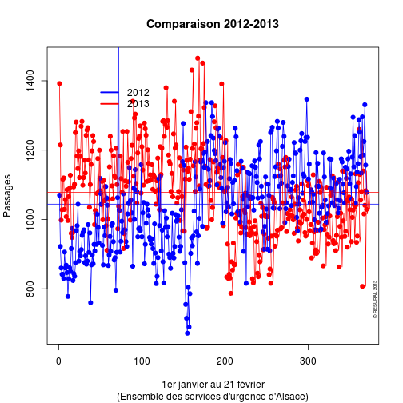
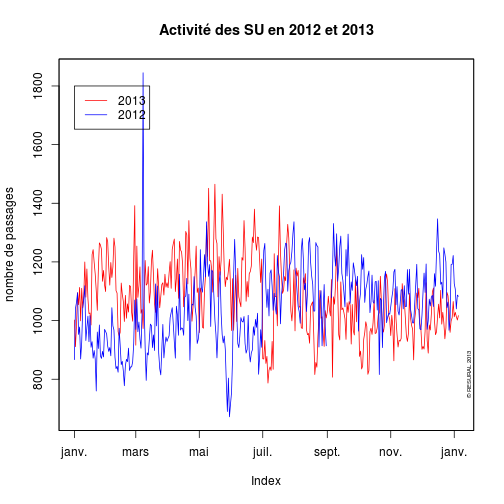
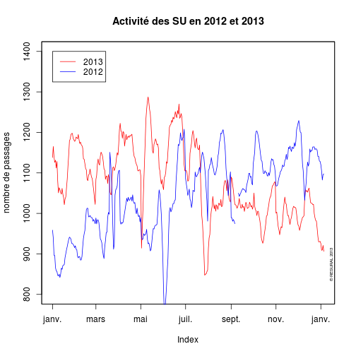

Etude des SAU d'Alsace sur 50 jours
========================================================

L'étude porte du 1/1/2013 au 22/2/2013 avec un compatatif sur la même période en 2012.
Les données sont extraite de SAGEC HUS et copiées/collées dans un tableur libre office. La dernière colonne (supprimer) est supprimées. La feuille est enregistrée sous *sau2013.csv*

```r
file <- "~/Documents/Resural/Stat Resural/SAU2013"
setwd(file)
timestamp()
```

```
## ##------ Sat Oct 12 14:13:35 2013 ------##
```

```r
d <- read.csv("sau2013.csv", header = TRUE)
```

Préparation des données
------------------------
Transformation de la colonne *date* du format jj/mm/aaaa au format yyyy-mm-dd

```r
d$date <- as.Date(d$date, "%d/%m/%Y")
```

Renommage de la colonne *organisme* par la création d'une nouvelle colonne *hop*
NB: on ignore le CMCO. Deux structures sont absentes de la base: Sta anne et Diaconnat-Fonderie

```r
d$hop[d$Organisme == "CCOM"] <- "HUS"
d$hop[d$Organisme == "CH Altkirch"] <- "ALK"
d$hop[d$Organisme == "CH de Colmar (CMC Le Parc)"] <- "COL"
d$hop[d$Organisme == "CH de Colmar (Louis Pasteur)"] <- "COL"
d$hop[d$Organisme == "CH de Guebwiller"] <- "GEB"
d$hop[d$Organisme == "CH de Mulhouse ( Hasenrain)"] <- "MUL"
d$hop[d$Organisme == "CH de Mulhouse (Emile Muller-Moenschberg"] <- "MUL"
d$hop[d$Organisme == "CH de Saverne"] <- "SAV"
d$hop[d$Organisme == "CH de Sélestat"] <- "SEL"
d$hop[d$Organisme == "CH de Thann"] <- "TAN"
d$hop[d$Organisme == "CH de Wissembourg"] <- "WIS"
d$hop[d$Organisme == "CHU de Strasbourg (Hôp. Civil)"] <- "HUS"
d$hop[d$Organisme == "CHU de Strasbourg(Hautepierre)"] <- "HUS"
d$hop[d$Organisme == "Clinique des Diaconesses"] <- "DIA"
d$hop[d$Organisme == "Clinique Ste Odile (Strasbourg"] <- "ODI"
d$hop[d$Organisme == "Clinique des 3 Frontières"] <- "CTF"
```

Renommage de la colonne *service* par la création d'une nouvelle colonne *ser2*

```r
d$ser2[d$service == "CCOM Chirurgie"] <- "CCOM"
d$ser2[d$service == "Upatou"] <- "sALK"
d$ser2[d$service == "SAU Le Parc"] <- "pCOL"
d$ser2[d$service == "SAU Pasteur"] <- "aCOL"
d$ser2[d$service == "UHTCD"] <- "sGEB"
d$ser2[d$service == "PEDIATRIE NEONATOLOGIE"] <- "pMUL"
d$ser2[d$service == "URGENCES"] <- "aMUL"
d$ser2[d$service == "S.A.U. (ADULTES)"] <- "aSAV"
d$ser2[d$service == "PEDIATRIE"] <- "pSAV"
d$ser2[d$service == "Acceuil des urgences"] <- "sSEL"
d$ser2[d$Organisme == "CH de Thann" & d$service == "Urgences"] <- "sTAN"
d$ser2[d$Organisme == "CH de Wissembourg" & d$service == "Urgences"] <- "sWIS"
d$ser2[d$service == "Urgences Médico-Chirurgicales NHC"] <- "NHC"
d$ser2[d$service == "Urgences chirurgicales pédiatriques"] <- "pHTP"
d$ser2[d$service == "Urgences Adulte HTP"] <- "aHTP"
d$ser2[d$service == "Gynéco-Obstétrique (HTP)"] <- "gHTP"
d$ser2[d$service == "SOS Main"] <- "sDIA"
d$ser2[d$Organisme == "Clinique Ste Odile (Strasbourg" & d$service == "UPATOU"] <- "sODI"
d$ser2[d$service == "UPATOU (Structure des urgences)"] <- "sCTF"
d$ser2[d$Organisme == "CH de Wissembourg" & d$service == "Urgences "] <- "sWIS"
```

Sauvegarde:

```r
save(d, file = "sau2013.Rda")
```

Chargement:
load("sau2013.Rda")

Résumé des donnnées
-------------------
d = dataframe pour 2013

```r
names(d)
```

```
##  [1] "date"              "Organisme"         "service"          
##  [4] "moins.de.1.an"     "plus.de.75.ans"    "entre.1.et.75.ans"
##  [7] "TOTAL.passages"    "hospitalisés"      "UHCD"             
## [10] "Transferts"        "hop"               "ser2"
```


analyse des données
-------------------
Tableau de l'ensemble des passages par jour pour l'ensemble des SAU:

```r
hosp2013 <- tapply(d$hospitalisés, d$date, sum)
hosp2013
```

```
## 2013-01-01 2013-01-02 2013-01-03 2013-01-04 2013-01-05 2013-01-06 
##        248        269        201        216        194        158 
## 2013-01-07 2013-01-08 2013-01-09 2013-01-10 2013-01-11 2013-01-12 
##        206        209        191        224        210        201 
## 2013-01-13 2013-01-14 2013-01-15 2013-01-16 2013-01-17 2013-01-18 
##        143        250        205        188        177        212 
## 2013-01-19 2013-01-20 2013-01-21 2013-01-22 2013-01-23 2013-01-24 
##        195        241        240        224        221        220 
## 2013-01-25 2013-01-26 2013-01-27 2013-01-28 2013-01-29 2013-01-30 
##        222        227        197        238        200        223 
## 2013-01-31 2013-02-01 2013-02-02 2013-02-03 2013-02-04 2013-02-05 
##        222        236        219        201        221        254 
## 2013-02-06 2013-02-07 2013-02-08 2013-02-09 2013-02-10 2013-02-11 
##        205        202        242        209        191        215 
## 2013-02-12 2013-02-13 2013-02-14 2013-02-15 2013-02-16 2013-02-17 
##        156        217        189        218        194        161 
## 2013-02-18 2013-02-19 2013-02-20 2013-02-21 2013-02-22 2013-02-23 
##        222        232        178        220        208        192 
## 2013-02-24 2013-02-25 2013-02-26 2013-02-27 2013-02-28 2013-03-01 
##        206        231        194        197        205        228 
## 2013-03-02 2013-03-03 2013-03-04 2013-03-05 2013-03-06 2013-03-07 
##        188        191        224        230        180        221 
## 2013-03-08 2013-03-09 2013-03-10 2013-03-11 2013-03-12 2013-03-13 
##        236        191        187        212        191        208 
## 2013-03-14 2013-03-15 2013-03-16 2013-03-17 2013-03-18 2013-03-19 
##        197        252        185        148        254        206 
## 2013-03-20 2013-03-21 2013-03-22 2013-03-23 2013-03-24 2013-03-25 
##        189        186        210        197        179        234 
## 2013-03-26 2013-03-27 2013-03-28 2013-03-29 2013-03-30 2013-03-31 
##        206        203        225        210        243        200 
## 2013-04-01 2013-04-02 2013-04-03 2013-04-04 2013-04-05 2013-04-06 
##        189        255        205        182        261        221 
## 2013-04-07 2013-04-08 2013-04-09 2013-04-10 2013-04-11 2013-04-12 
##        185        217        187        217        208        239 
## 2013-04-13 2013-04-14 2013-04-15 2013-04-16 2013-04-17 2013-04-18 
##        195        197        218        214        222        219 
## 2013-04-19 2013-04-20 2013-04-21 2013-04-22 2013-04-23 2013-04-24 
##        216        191        177        236        234        194 
## 2013-04-25 2013-04-26 2013-04-27 2013-04-28 2013-04-29 2013-04-30 
##        221        203        139        184        197        201 
## 2013-05-01 2013-05-02 2013-05-03 2013-05-04 2013-05-05 2013-05-06 
##        171        209        225        216        206        230 
## 2013-05-07 2013-05-08 2013-05-09 2013-05-10 2013-05-11 2013-05-12 
##        221        172        186        214        198        148 
## 2013-05-13 2013-05-14 2013-05-15 2013-05-16 2013-05-17 2013-05-18 
##        225        218        175        203        213        247 
## 2013-05-19 2013-05-20 2013-05-21 2013-05-22 2013-05-23 2013-05-24 
##        196        171        217        210        195        221 
## 2013-05-25 2013-05-26 2013-05-27 2013-05-28 2013-05-29 2013-05-30 
##        189        164        212        203        171        199 
## 2013-05-31 2013-06-01 2013-06-02 2013-06-03 2013-06-04 2013-06-05 
##        190        169        184        209        204        217 
## 2013-06-06 2013-06-07 2013-06-08 2013-06-09 2013-06-10 2013-06-11 
##        233        225        214        189        177        213 
## 2013-06-12 2013-06-13 2013-06-14 2013-06-15 2013-06-16 2013-06-17 
##        196        193        194        180        196        235 
## 2013-06-18 2013-06-19 2013-06-20 2013-06-21 2013-06-22 2013-06-23 
##        203        200        185        227        192        159 
## 2013-06-24 2013-06-25 2013-06-26 2013-06-27 2013-06-28 2013-06-29 
##        223        204        204        156        187        180 
## 2013-06-30 2013-07-01 2013-07-02 2013-07-03 2013-07-04 2013-07-05 
##        157        215        187        166        172        209 
## 2013-07-06 2013-07-07 2013-07-08 2013-07-09 2013-07-10 2013-07-11 
##        198        187        212        199        206        186 
## 2013-07-12 2013-07-13 2013-07-14 2013-07-15 2013-07-16 2013-07-17 
##        187        164        183        240        224        179 
## 2013-07-18 2013-07-19 2013-07-20 2013-07-21 2013-07-22 2013-07-23 
##        193        205        191         87         99        113 
## 2013-07-24 2013-07-25 2013-07-26 2013-07-27 2013-07-28 2013-07-29 
##         89        121         95         82         87        131 
## 2013-07-30 2013-07-31 
##        116        140
```

Moyenne des passages par jour ensemble des SAU:

```r
mean(hosp2013)
```

```
## [1] 199.1
```

```r
summary(hosp2013)
```

```
##    Min. 1st Qu.  Median    Mean 3rd Qu.    Max. 
##      82     187     203     199     219     269
```

```r
plot(hosp2013, pch = 19, col = "red", ylab = "Passages", xlab = "Semaines")
abline(h = mean(hosp2013))
```

 


Moyenne des passages par jour/SAU

```r
a <- tapply(d$TOTAL.passages, d$date, mean)
a
```

```
## 2013-01-01 2013-01-02 2013-01-03 2013-01-04 2013-01-05 2013-01-06 
##      63.27      55.23      47.52      48.95      53.14      50.91 
## 2013-01-07 2013-01-08 2013-01-09 2013-01-10 2013-01-11 2013-01-12 
##      49.00      50.33      48.00      49.36      45.32      48.45 
## 2013-01-13 2013-01-14 2013-01-15 2013-01-16 2013-01-17 2013-01-18 
##      51.90      53.71      48.00      47.40      48.10      52.10 
## 2013-01-19 2013-01-20 2013-01-21 2013-01-22 2013-01-23 2013-01-24 
##      50.09      56.86      58.23      53.77      52.14      54.45 
## 2013-01-25 2013-01-26 2013-01-27 2013-01-28 2013-01-29 2013-01-30 
##      50.95      56.29      57.68      58.32      49.95      50.95 
## 2013-01-31 2013-02-01 2013-02-02 2013-02-03 2013-02-04 2013-02-05 
##      53.23      51.55      56.50      57.18      57.50      53.27 
## 2013-02-06 2013-02-07 2013-02-08 2013-02-09 2013-02-10 2013-02-11 
##      49.29      52.43      52.68      54.45      56.45      58.33 
## 2013-02-12 2013-02-13 2013-02-14 2013-02-15 2013-02-16 2013-02-17 
##      44.77      48.86      48.76      51.19      56.00      54.00 
## 2013-02-18 2013-02-19 2013-02-20 2013-02-21 2013-02-22 2013-02-23 
##      54.55      49.23      47.41      50.45      47.57      55.65 
## 2013-02-24 2013-02-25 2013-02-26 2013-02-27 2013-02-28 2013-03-01 
##      50.19      52.14      46.76      45.55      47.71      48.09 
## 2013-03-02 2013-03-03 2013-03-04 2013-03-05 2013-03-06 2013-03-07 
##      52.36      56.36      54.55      49.86      50.48      53.82 
## 2013-03-08 2013-03-09 2013-03-10 2013-03-11 2013-03-12 2013-03-13 
##      51.18      56.05      54.77      55.05      48.65      49.43 
## 2013-03-14 2013-03-15 2013-03-16 2013-03-17 2013-03-18 2013-03-19 
##      48.81      53.77      53.24      53.95      59.71      48.21 
## 2013-03-20 2013-03-21 2013-03-22 2013-03-23 2013-03-24 2013-03-25 
##      47.95      52.90      52.19      57.00      52.95      55.45 
## 2013-03-26 2013-03-27 2013-03-28 2013-03-29 2013-03-30 2013-03-31 
##      47.55      47.52      56.00      55.18      60.95      53.57 
## 2013-04-01 2013-04-02 2013-04-03 2013-04-04 2013-04-05 2013-04-06 
##      58.77      59.27      50.18      52.35      54.18      56.09 
## 2013-04-07 2013-04-08 2013-04-09 2013-04-10 2013-04-11 2013-04-12 
##      56.41      57.73      51.24      55.00      51.95      49.95 
## 2013-04-13 2013-04-14 2013-04-15 2013-04-16 2013-04-17 2013-04-18 
##      58.09      57.36      56.50      52.86      54.59      55.33 
## 2013-04-19 2013-04-20 2013-04-21 2013-04-22 2013-04-23 2013-04-24 
##      52.95      53.76      53.05      52.64      49.41      51.32 
## 2013-04-25 2013-04-26 2013-04-27 2013-04-28 2013-04-29 2013-04-30 
##      51.05      51.52      49.71      52.95      53.50      49.36 
## 2013-05-01 2013-05-02 2013-05-03 2013-05-04 2013-05-05 2013-05-06 
##      48.95      55.00      51.36      54.82      61.10      58.41 
## 2013-05-07 2013-05-08 2013-05-09 2013-05-10 2013-05-11 2013-05-12 
##      56.36      57.91      62.73      57.55      58.41      53.91 
## 2013-05-13 2013-05-14 2013-05-15 2013-05-16 2013-05-17 2013-05-18 
##      53.05      52.73      49.14      51.50      50.76      62.35 
## 2013-05-19 2013-05-20 2013-05-21 2013-05-22 2013-05-23 2013-05-24 
##      60.95      54.82      55.23      47.59      48.32      49.14 
## 2013-05-25 2013-05-26 2013-05-27 2013-05-28 2013-05-29 2013-05-30 
##      53.55      49.85      55.00      50.76      48.35      51.95 
## 2013-05-31 2013-06-01 2013-06-02 2013-06-03 2013-06-04 2013-06-05 
##      46.00      50.77      57.57      61.63      56.95      52.18 
## 2013-06-06 2013-06-07 2013-06-08 2013-06-09 2013-06-10 2013-06-11 
##      53.14      55.90      62.43      65.05      57.38      55.00 
## 2013-06-12 2013-06-13 2013-06-14 2013-06-15 2013-06-16 2013-06-17 
##      58.00      54.05      57.41      60.90      69.76      61.81 
## 2013-06-18 2013-06-19 2013-06-20 2013-06-21 2013-06-22 2013-06-23 
##      52.24      53.23      54.73      57.33      69.10      60.95 
## 2013-06-24 2013-06-25 2013-06-26 2013-06-27 2013-06-28 2013-06-29 
##      63.00      54.95      50.05      48.70      48.90      54.80 
## 2013-06-30 2013-07-01 2013-07-02 2013-07-03 2013-07-04 2013-07-05 
##      55.55      55.86      50.24      47.57      49.24      53.00 
## 2013-07-06 2013-07-07 2013-07-08 2013-07-09 2013-07-10 2013-07-11 
##      61.05      63.24      60.24      54.10      54.76      52.57 
## 2013-07-12 2013-07-13 2013-07-14 2013-07-15 2013-07-16 2013-07-17 
##      54.65      57.45      61.80      63.23      53.59      46.76 
## 2013-07-18 2013-07-19 2013-07-20 2013-07-21 2013-07-22 2013-07-23 
##      51.52      51.52      58.48      64.15      61.93      55.33 
## 2013-07-24 2013-07-25 2013-07-26 2013-07-27 2013-07-28 2013-07-29 
##      60.14      55.40      56.21      58.53      65.69      62.13 
## 2013-07-30 2013-07-31 
##      54.31      58.00
```

Ratio hospitalisation/passage. Hospitalisation est la somme des hospitalisations dans les servives + UHCD:

```r
hosp2013 <- tapply(d$hospitalisés, d$date, sum)
b <- round(100 * (d$hospitalisés + d$UHCD)/d$TOTAL.passages, 2)
```

taux moyen d'hospitalisation durant la période:

```r
m1 <- mean(b, na.rm = T)
m1
```

```
## [1] Inf
```

```r
sd(b, na.rm = T)
```

```
## [1] NaN
```

Taux moyen d'hospitalisation par jour:

```r
a <- tapply(b, d$date, mean, na.rm = T)
plot(a, pch = 19, col = "red")
abline(h = m1, col = "blue")
```

 

Comparaison 2013 - 2012
-----------------------
On récupère les données 2012 et on utilise par(new=T) pour superposer 2 graphiques:

```r
load("../SAU2012/sau2012.Rda")
a2 <- tapply(d2$TOTAL.passages, d2$date, sum)
a <- tapply(d$TOTAL.passages, d$date, sum)
# sauvegarde des paramètres graphique
old <- par()
# calcul d'une ordonnée commune aux 2 courbes
ylim1 <- range(c(max(a), min(a2)))
# on trace la première
plot(a, ylim = ylim1, pch = 19, col = "red", ylab = "Passages", xlab = "1er janvier au 21 février", 
    main = "Comparaison 2012-2013", sub = "(Ensemble des services d'urgence d'Alsace)")
# on modifie par() pour forcer la superposition
par(new = TRUE, ann = FALSE)
# desssin de la 2ème courbe
plot(a2, ylim = ylim1, pch = 19, col = "blue", axes = FALSE)
# tracé des droites moyennes
abline(h = mean(a2), col = "blue")
abline(h = mean(a), col = "red")
# tracé des lignes joignant les points
lines(a, ylim = ylim1, pch = 19, col = "red")
lines(a2, ylim = ylim1, pch = 19, col = "blue")
# ajout de la légende
legend(40, 1400, c("2012", "2013"), lty = c(1, 1), lwd = c(2.5, 2.5), col = c("blue", 
    "red"), bty = "n")
# copyright
mtext("© RESURAL 2013", cex = 0.5, side = 4, line = -1, adj = 0.1)
```

 

```r
# restauration des paramètres graphiques
par(old)
```

```
## Warning: graphical parameter "cin" cannot be set
## Warning: graphical parameter "cra" cannot be set
## Warning: graphical parameter "csi" cannot be set
## Warning: graphical parameter "cxy" cannot be set
## Warning: graphical parameter "din" cannot be set
## Warning: graphical parameter "page" cannot be set
```

Comparaison des activités:

```r
n <- length(a)
n
```

```
## [1] 212
```

```r
summary(a)
```

```
##    Min. 1st Qu.  Median    Mean 3rd Qu.    Max. 
##     787    1070    1130    1130    1210    1460
```

```r
summary(a2[1:n])
```

```
##    Min. 1st Qu.  Median    Mean 3rd Qu.    Max. 
##     672     902     974     996    1080    1840
```

```r
round((mean(a)/mean(a2[1:n]) - 1) * 100, 2)
```

```
## [1] 13.49
```

Pour présenter ces tableaux en Latex:

stargazer(as.data.frame(a),summary=TRUE)

stargazer(as.data.frame(a2[1:length(a)]),summary=TRUE,digit.separator=" ",digits=2,median=TRUE,iqr=TRUE)

voir RPU2013/sweve/test pour un exemple


Utilisation de la librairie *zoo*

```r
library("zoo")
```

```
## 
## Attaching package: 'zoo'
## 
## Les objets suivants sont masqués from 'package:base':
## 
##     as.Date, as.Date.numeric
```

```r
tsa <- zoo(a, unique(d$date))
head(tsa)
```

```
## 2013-01-01 2013-01-02 2013-01-03 2013-01-04 2013-01-05 2013-01-06 
##       1002        911        982       1095       1054       1113
```

```r
plot(tsa)
```

 

```r
tsb <- zoo(a2, unique(d2$date))
plot(tsb)
```

 

Moyenne lissée sur 7 jours

```r
ma <- rollmean(tsa, 7)
plot(ma, main = "Moyenne lissée sur 7 jours")
```

 

```r

mb <- rollmean(tsb, 7)
plot(mb, main = "Moyenne lissée sur 7 jours")
```

 

Utilisation de *xts*

```r
library("xts")
ts2 <- xts(a, unique(d$date))
```

Combinaison des deux courbes:

```r
tsc <- zoo(cbind(a, a2[1:length(a)]), unique(d$date))
plot(tsc)
```

 

```r
plot(tsc, screens = 1, col = c("red", "blue"), main = "Activité des SU en 2012 et 2013", 
    ylab = "nombre de passages")
legend(as.Date("2013-01-01"), 1800, c("2013", "2012"), col = c("red", "blue"), 
    lty = "solid")
mtext("© RESURAL 2013", cex = 0.5, side = 4, line = -1, adj = 0.1)
```

 

moyennes lissées:

```r
tsc2 <- zoo(cbind(as.numeric(ma), as.numeric(mb[1:length(ma)])), unique(d$date))
plot(tsc2, screens = 1, col = c("red", "blue"), main = "Activité des SU en 2012 et 2013", 
    ylab = "nombre de passages", ylim = c(800, 1400))
legend(as.Date("2013-01-01"), 1400, c("2013", "2012"), col = c("red", "blue"), 
    lty = "solid")
mtext("© RESURAL 2013", cex = 0.5, side = 4, line = -1, adj = 0.1)
```

 

Activité des SAMU
=================

```r
samu <- read.csv("samu2013.csv", header = TRUE)
names(samu)
```

```
##  [1] "date"        "service"     "affaires"    "primaires"   "secondaires"
##  [6] "néonat"      "TIIH"        "ASSU"        "VSAV"        "conseils"   
## [11] "Medecins"
```

```r
samu$date <- as.Date(samu$date, "%d/%m/%Y")
min(samu$date)
```

```
## [1] "2013-01-01"
```

```r
max(samu$date)
```

```
## [1] "2013-10-01"
```


Créer 2 SAMU:

```r
s67 <- samu[samu$service == "SAMU 67", ]
s68 <- samu[samu$service == "SAMU 68", ]
ts67 <- zoo(s67$affaires, s67$date)
plot(ts67)
```

 

```r
ts68 <- zoo(s68$affaires, s68$date)
plot(ts68)
```

 

```r
tssa <- zoo(cbind(s67$affaires, s68$affaires), s67$date)
```

```
## Warning: number of rows of result is not a multiple of vector length (arg
## 2)
```

```r
plot(tssa)
```

 

```r

plot(tssa, screens = 1, col = c("red", "blue"), main = "Activité des SAMU en 2013", 
    ylab = "nombre d'affaires", ylim = c(400, 1600), xlab = "Date(jours)")
legend(as.Date("2013-01-01"), 1600, c("SAMU 67", "SAMU 68"), col = c("red", 
    "blue"), lty = "solid", cex = 0.5)
mtext("© RESURAL 2013", cex = 0.5, side = 4, line = -1, adj = 0.1)
```

 

Courbes lissées

```r
m67 <- rollmean(tssa, 7)
plot(m67, screens = 1, col = c("red", "blue"), main = "Activité des SAMU en 2013", 
    ylab = "nombre d'affaires", ylim = c(400, 1600), xlab = "Date(jours)")
legend(as.Date("2013-01-01"), 1600, c("SAMU 67", "SAMU 68"), col = c("red", 
    "blue"), lty = "solid", cex = 0.5)
mtext("© RESURAL 2013", cex = 0.5, side = 4, line = -1, adj = 0.1)
```

 

Chargement du fichier pour 2012:
---------------------------------

```r
samu2012 <- read.csv("samu2012.csv", header = TRUE)
names(samu2012)
```

```
##  [1] "date"        "service"     "affaires"    "primaires"   "secondaires"
##  [6] "néonat"      "TIIH"        "ASSU"        "VSAV"        "conseils"   
## [11] "Medecins"
```

```r
samu2012$date <- as.Date(samu2012$date, "%d/%m/%Y")
min(samu2012$date)
```

```
## [1] "2012-01-01"
```

```r
max(samu2012$date)
```

```
## [1] "2012-12-31"
```

```r

min(samu2012$date[samu2012$service == "SAMU 68"])
```

```
## [1] "2012-06-20"
```

Il manque les données pour le premier semestre 2012 pour le samu 68

Créer les SAMU:

```r
s672012 <- samu2012[samu2012$service == "SAMU 67", ]
ts672012a <- zoo(s672012$affaires, s672012$date)
plot(ts672012a, main = "Affaires - SAMU 67 en 2012")
```

 

```r
m67672012a <- rollmean(ts672012a, 7)
plot(m67672012a, main = "Affaires (lissage) - SAMU 67 en 2012")
```

 

Comparaison 2012-2013

```r
tssa2 <- zoo(cbind(s67$affaires, s672012$affaires), s67$date)
```

```
## Warning: number of rows of result is not a multiple of vector length (arg
## 1)
```

```r
plot(tssa2, screens = 1, col = c("red", "blue"), main = "Comparaison 2012-2013")
```

 

```r
tssa2lisse <- rollmean(tssa2, 7)
plot(tssa2lisse, screens = 1, col = c("red", "blue"), main = "Comparaison 2012-2013 (moyennes lissées)", 
    xlab = "Activité du SAMU 67", ylab = "Nb.affaires/jour")
legend(as.Date("2013-01-01"), 1400, c("2013", "2012"), col = c("red", "blue"), 
    lty = "solid", cex = 0.8)
mtext("© RESURAL 2013", cex = 0.5, side = 4, line = -1, adj = 0.1)
```

 

Comparaison passages/hospitalisations
-------------------------------------

```r
hosp2013 <- tapply(d$hospitalisés, d$date, sum)
mean(hosp2013)
```

```
## [1] 199.1
```

```r
sd(passage2013)
```

```
## Error: objet 'passage2013' introuvable
```

```r
median(passage2013)
```

```
## Error: objet 'passage2013' introuvable
```

```r

passage2013 <- tapply(d$TOTAL.passages, d$date, sum)
mean(passage2013)
```

```
## [1] 1131
```

```r
sd(passage2013)
```

```
## [1] 120.5
```

```r
median(passage2013)
```

```
## [1] 1127
```

```r

round(mean(hosp2013) * 100/mean(passage2013), 2)
```

```
## [1] 17.61
```

```r

a <- cbind(passage2013, hosp2013)
zoo2013 <- zoo(a, unique(d$date))
plot(zoo2013)
```

 

```r
zoo2013lisse <- rollmean(zoo2013, 7)
plot(zoo2013lisse, screens = 1, main = "2013 - Passages vs hospitalisation", 
    col = c("red", "blue"), xlab = "Moyennes lissées")
legend(as.Date("2013-01-01"), 800, c("passages", "hospitalizations"), col = c("red", 
    "blue"), lty = "solid", cex = 0.8)
mtext("© RESURAL 2013", cex = 0.5, side = 4, line = -1, adj = 0.1)
```

 


